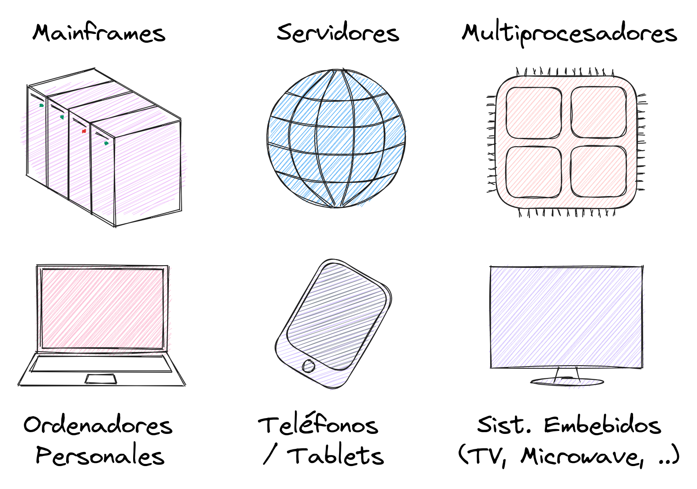
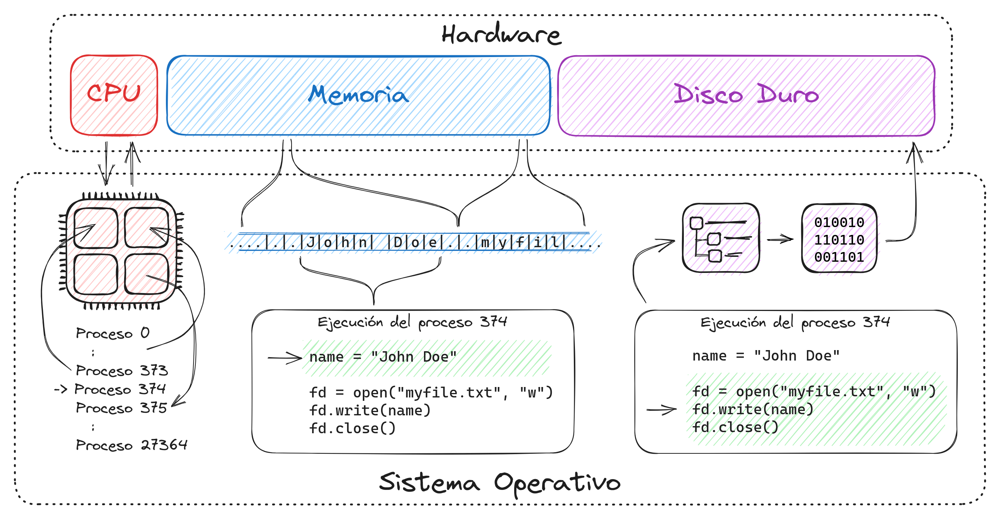

# 1. Introducción al curso

Un **sistema operativo** es un programa que se encarga de manejar los recursos
del hardware y servir como intermediario entre estos recursos y las
aplicaciones.

Algunos tipos de sistemas operativos:

- **Mainframe:** Sistemas operativos que manejan gran cantidad de operaciones
I/O y dispositivos de almacenamiento.
- **Server OS:** Sistemas operativos que se usan en servidores.
- **Multiprocessor OS:** Sistemas operativos que utilizan más de un CPU.
- **Personal Computer OS:** Sistemas operativos de ordenadores personales.
- **Handheld Computers OS:** Sistemas operativos de tablets, smartphones, ...etc
- **Embedded OS:** Sistemas operativos embebidos en ciertos dispositivos (TV,
Microondas, etc)

    

Muchos de estos tipos de SOs se solapan. Incluso un solo SO, como Linux, puede
servir para varias de estas funciones.

La respuesta a la pregunta **¿por qué existen los SOs?** es simple: facilitar el
uso de los recursos del hardware a los usuarios, la pregunta difícil de
responder es **¿cómo lo hace?**

Supongamos que ejecutamos un navegador:

- ¿Cómo puede ejecutarse este programa junto al resto de programas que están
corriendo al mismo tiempo?
- ¿Cómo sabe que parte de la memoria puede usar y que parte no?
- ¿Cómo puede ejecutar varias tareas al mismo tiempo? (por ejemplo realizar
varias descargas al mismo tiempo)
- ¿Cómo se almacena exactamente en el disco duro las descargas que haga el
navegador?

Para poder responder estas preguntas estudiaremos cómo funciona un SO analizando
3 conceptos principales:

**Virtualización:** Cómo el SO crea una abstracción sobre los recursos del
*hardware. 
**Concurrencia:** Cómo el SO maneja varias tareas (que tienen recursos
compartidos principalmente) en un mismo intervalo de tiempo. 
**Persistencia:** Cómo el SO lee y escribe la información en dispositivos de
almacenamiento.

    

Todos estas funciones del SO resuelven problemas durante la ejecución de los
programas, pero, ¿cómo exactamente es que se ejecuta un programa? ¿cómo se
convierte de **un archivo** a **algo que realiza operaciones**? Más interesante,
si el SO es un programa también, ¿cómo se ejecuta el SO cuando encendemos la
computadora?

En la próxima conferencia abordaremos todas estas preguntas :)
