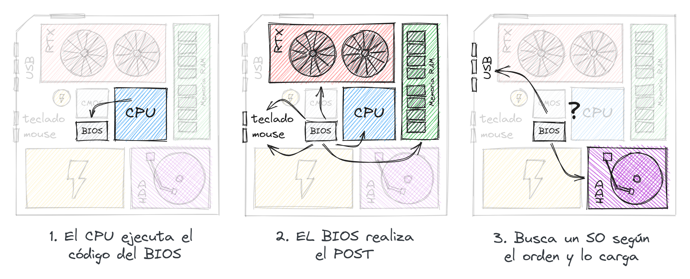
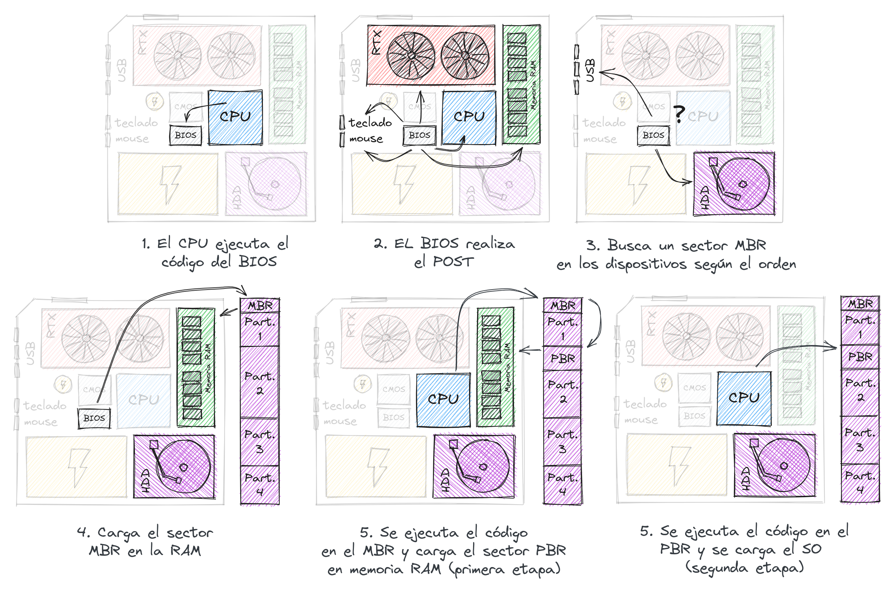
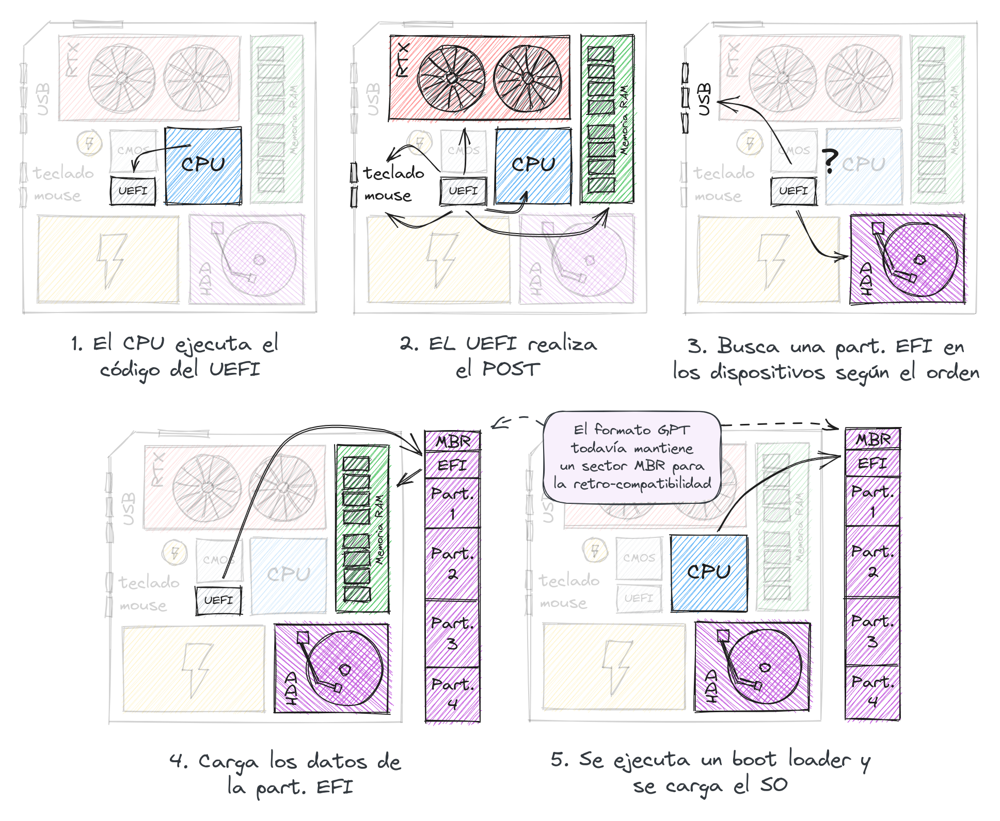
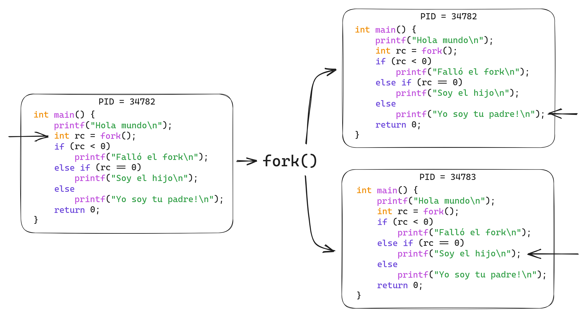
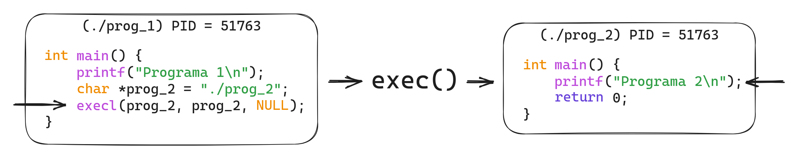
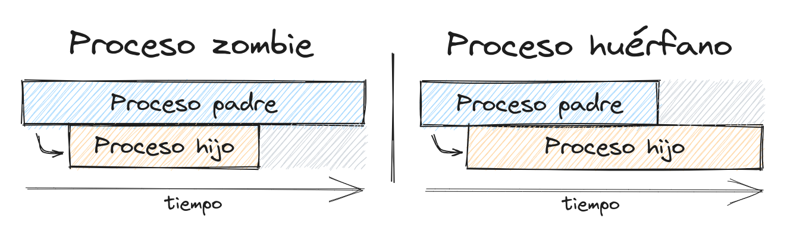
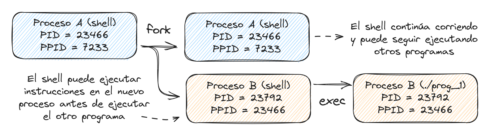

# C2 - Procesos

## Inicio del SO

El proceso de inicio cuando encendemos la computadora de forma resumida es:

1. El CPU ejecuta un código que contiene un chip del motherboard.
2. El chip realiza unos test.
3. Busca un SO y lo carga.

El chip que se encarga de realizar los test y buscar el SO es el **BIOS (Basic
Input/Output System)**. El conjunto de pruebas que realiza el BIOS es conocido
como **POST (Power On Self Test)** y de forma general realiza pruebas sobre los
siguientes elementos:

- Tarjeta gráfica (luego de esto se enciende el monitor)
- CPU
- RAM
- Teclado y Mouse (algunos teclados parpadean una luz en este momento, además es
en este momento cuando pueden usar la tecla designada para entrar en las
opciones del BIOS)

Actualizamos el proceso de forma general:

1. El CPU ejecuta un el código del BIOS.
2. El BIOS realiza el POST:
   - Tarjeta gráfica
   - CPU
   - RAM
   - Teclado y Mouse
3. El BIOS busca un SO y lo carga.

<p align="center">
    
</p>

Ahora, ¿cómo el BIOS busca el SO? Antes, es necesario explicar que existen dos
formas principales de guardar la información de las particiones de un disco
**MBR (Master Boot Record)** y **GPT (GUID Partition Table)**. Supongamos que el
disco guarda esta información como lo especifica el tipo MBR (más adelante
veremos que pasa con GPT).

Según MBR, el primer sector del disco duro es donde se encuentra el código que
se encarga de cargar el SO. Es necesario aclarar que "MBR" también se usa para
nombrar este primer sector. Los sectores en los discos duro tienen generalmente
un tamaño de 512 bytes y son conocidos como **LBA (Logical Block Allocation)**,
por tanto se puede decir que el MBR se encuentra en el LBA 0 (LBA cero).

Entonces, el BIOS carga el sector MBR en la memoria RAM y ordena al CPU a
ejecutar dicho código.

Actualicemos el proceso:

1. El CPU ejecuta un el código del BIOS.
2. El BIOS realiza el POST:
   - Tarjeta gráfica
   - CPU
   - RAM
   - Teclado y Mouse
3. El BIOS analiza el orden de booting y selecciona el primer dispositivo donde
encuentre el MBR.
4. Carga el MBR en memoria RAM y manda a ejecutarlo. (aquí Termina el trabajo
del BIOS).
5. Se carga y ejecuta el SO.

<p align="center">
    
</p>

Generalmente 512 bytes no son suficiente para almacenar el código que carga un
SO. Por lo tanto, muchas veces este proceso se divide en dos etapas conocidas
como: **First-Stage Booting** y **Second-Stage Booting**. La idea es que el
código en el MBR ejecute un código almacenado en otra parte del disco (primera
etapa) el cual entonces se encargará de cargar el SO (segunda etapa).

El sector MBR no se encuentra en ninguna partición, pero el lugar del disco duro
que contiene el código de la segunda etapa de booting sí. Por ello, el lugar en
el disco donde se encuentra esta segunda etapa es conocido como **PBR (Partition
Boot Record)** o **VBR (Volumen Boot Record)**. Esta segunda etapa se encuentra
en el primer LBA de alguna de las particiones del disco.

Actualizamos:

1. El CPU ejecuta un el código del BIOS.
2. El BIOS realiza el POST:
   - Tarjeta gráfica
   - CPU
   - RAM
   - Teclado y Mouse
3. El BIOS analiza el orden de booting selecciona el primer lugar donde
encuentre un MBR.
4. Carga el MBR en memoria RAM y manda a ejecutarlo. (aquí termina el trabajo
del BIOS).
5. Se ejecuta el código que estaba en el MBR (primera etapa)
6. Este código carga entonces el código almacenado en el PBR (segunda etapa) y
se carga el SO.

<p align="center">
    
</p>

El programa que se almacena en el MBR y el PBR se suele llamar **boot loader**,
y es el que carga el SO. En casos como el GRUB el boot loader es capaz de
reconocer los SOs que se encuentran en el disco y muestra un menú que indica
cual SO el usuario desea cargar.

El uso del BIOS y MBR se remonta a los primeros sistemas y por tanto fueron
diseñados para dichas tecnologías. Esto trae consigo una serie de desventajas,
entre ellas:

- El BIOS solo funciona sobre el CPU en **Real Mode** (en vez de **Protected
Mode**). Entre las desventajas del Real Mode se encuentran:
  - El procesador funciona como los antiguos procesadores 8088 / 8086.
  - La capacidad de direcciones de memoria se limita a 1MB.
  - No existe manejo de memoria virtual (más adelante en el curso hablaremos de
  este tema).
- El formato de partición MBR no puede ser usado en discos de más de 2.2TB.
- El formato de partición MBR no permite tener más de 4 particiones en el disco
duro. (Se puede simular tener más de 4 mediante una partición extendida que
contenga particiones lógicas).

Es por esto que en 2011 se crea el sistema **UEFI (Unified Extensible Firmware
Interface)** y consigo el formato de particiones **GPT**. Entre las ventajas que
ofrece están:

UEFI:

- Proceso de booteo más rápido.
- Opción de booteo seguro (evita que se bootee desde apps no autorizadas).
- Funciona sobre el CPU en **Protected Mode** (en vez de **Real Mode**).

GPT:

- Puede ser usado en discos hasta de 9 zettabytes.
- Puede ofrecer prácticamente una cantidad ilimitada de particiones (depende del
SO).
- Guarda la información de las particiones y booteo repetida en varias partes
del disco.

Entonces, ¿cómo funciona el proceso ahora? En los discos que usan el formato GPT
cada partición se identifica con un **GUID (Globally Unique Identifier)**.
Además existe un tipo de partición especial que se puede crear llamada **ESP
(EFI System Partition)** la cual tiene asignado un GUID específico. Esta
partición (independiente del SO) contiene información sobre los boot loaders,
drivers y aplicaciones adicionales que puede ejecutar el UEFI.

Una vez el UEFI termina de hacer las pruebas del POST busca en el disco esta
partición EFI (por su GUID). En esta partición se selecciona entonces (de forma
automática o manual) que boot loader usar y se ejecuta el mismo. El proceso
quedaría de la siguiente forma:

1. El CPU ejecuta un el código del UEFI.
2. El UEFI realiza el POST:
   - Tarjeta gráfica
   - CPU
   - RAM
   - Teclado y Mouse
3. El UEFI analiza el orden de booting y selecciona el primer lugar donde
encuentre una partición EFI.
4. Carga los datos del la partición EFI
5. Busca un boot loader, lo ejecuta y se carga entonces el OS.

<p align="center">
    
</p>

## ¿Qué pasa al cargar el SO?

Una vez el sistema operativo comienza su ejecución se inicializan sus propias
componentes y dispositivos, así como los software que se encargan de controlar
dichos dispositivos (los drivers). Esta parte del sistema operativo es la que
llamamos el kernel y los programas que el SO ejecuta aquí corren en **kernel
mode**. Solo estos programas tienen acceso a los recursos del sistema.

Luego, el SO ejecuta los software necesarios para la interacción con el usuario.
Estos programas se ejecutan en **user mode** y no tienen acceso a los recursos
directamente.

La forma en la que el SO virtualiza el CPU y ejecuta varios programas al mismo
tiempo es ejecutando cada uno de poco en poco. Esto es lo que se llama **time
sharing**.

## Procesos

Cada uno de estos programas que está corriendo en el SO es lo que llamamos un
**proceso**. De forma general un **proceso** es un programa que se encuentra en
ejecución en el SO (tanto los que el SO ejecuta automáticamente como los que el
usuario ejecuta).

Cada función que podamos realizar en la computadora está gobernada por un
programa, y por ende, un proceso. Cada uno de ellos está identificado además por
un **PID (Process ID)** (un número) y la información de cada proceso la guarda
el SO en una **tabla de procesos**.

La acción de ejecutar un proceso es hecha por otro proceso. Es por ello que los
procesos también pueden verse como un árbol donde cada nodo (proceso hijo)
proviene de la ejecución de un proceso padre. Cada proceso contiene además un
**PPID (Parent Process ID)**, el PID del proceso padre.

> La acción de terminar un proceso de forma forzada se le llama **kill**:
> <p align="center">
> 	
> </p>

Sin embargo ejecutar un proceso es algo que requiere un acceso especial a los
recursos (memoria, CPU, etc). Por tanto, ¿cómo un proceso cualquiera (que esté
corriendo en **user mode**) puede ejecutar otro proceso?

## API

Para ello el SO define un API, una serie de funciones que ofrece al resto de
aplicaciones. Estas funciones (que corren en **kernel mode**) son conocidas como
**System Calls** o llamados al sistema.

Referente a los procesos el SO ofrece diversas funciones destinadas a la
creación y control de estos:

### `fork`

Cuando un proceso ejecuta `fork` se crea un proceso hijo **casi** idéntico al
proceso padre. Este proceso hijo no comienza su ejecución en el **entry point**
(main), sino que sigue la ejecución en el mismo lugar donde se realizó el
`fork`.

¿Pero entonces, que sentido tiene ese hijo si va a ejecutar el mismo código del
padre?

Cuando una instrucción `fork` se ejecuta la misma tiene un valor de retorno
(vamos a llamarle `rc`) y en dependencia de este pueden ocurrir tres casos:

- `rc < 0`: La instrucción `fork` falló.
- `rc == 0`: Es la ejecución del proceso hijo.
- `rc > 0`: Es la ejecución del proceso padre y `rc` contiene el PID del proceso
hijo.

Usando este valor podemos definir que hará el nuevo proceso hijo y que seguirá
haciendo el proceso padre original.

<p align="center">
    
</p>

Como ahora son dos procesos diferentes ejecutándose y el SO realiza time-sharing
ambos se irán ejecutando poco a poco. Por tanto, qué código se ejecuta primero
no es algo que se pueda determinar.

### `wait`

En ocasiones el proceso padre quisiera esperar que termine la ejecución del
proceso hijo. Es por ello que existe la instrucción `wait`. Cuando se ejecuta,
el proceso padre espera a que termine la ejecución del proceso hijo y luego
continúa su ejecución.

Pero, ¿y si quisiera ejecutar un programa diferente al programa actual?jh

### `exec`

Para ello existe la instrucción `exec`. Sin embargo, esta instrucción no crea un
proceso nuevo. En cambio, de forma resumida, carga el código del programa a
ejecutar en el mismo lugar de memoria que ya tiene asignado el proceso y
continúa su ejecución como si fuera el programa nuevo.

<p align="center">
    
</p>

Es por esto que generalmente cuando queremos que un programa mande a ejecutar a
otro (y seguir la ejecución del padre) se usa una combinación de `fork` y
`exec`.

### Procesos huérfanos y zombies

Por último, cuando un proceso hijo termina, su entrada en la tabla de procesos
no es eliminada hasta que el padre haga un wait a el PID de dicho proceso hijo.
Si el proceso padre no realiza esta operación el proceso hijo se dice que está
en estado **zombie**. Todo proceso pasa a ser zombie antes de ser eliminado de
la tabla de procesos.

Por otra parte, si el proceso padre termina antes que el proceso hijo, el
proceso hijo se dice que es un proceso **huérfano**. En este caso el kernel
establece como nuevo proceso padre el proceso con PID = 1 (init).

¿Cómo sabe entonces el proceso init que tiene q realizar un wait a estos
procesos huérfanos cuando terminen?

Para ello es necesario explicar qué son las **señales**. En ocasiones el SO
necesita notificar a los procesos de ciertos eventos, por ejemplo cuando alguna
operación en el CPU falló o cuando se le ordena de forma externa terminar su
ejecución. Cada programa puede definir qué hacer cuando le llega una señal en
dependencia de su tipo, esto es lo que llamamos **signal handlers**.

> Una de las señales más usadas es SIGKILL la cual termina la ejecución de un proceso inmediatamente.

Entonces, cada cierto tiempo el SO revisa la tabla de procesos y envía una señal
SIGCHILD a los padres de los procesos zombies (que ya terminaron). Si el proceso
es huérfano, su PPID se establece como 1 (init) y dicho proceso se encarga de
hacer wait en el handler del SIGCHILD.

<p align="center">
    
</p>

### ¿Por qué el API está pensada de esta manera?

Resulta que esta forma es muy útil para implementar un **shell**. Esta
combinación de `fork`/`exec` le da la posibilidad al shell seguir su ejecución
luego de realizar el `fork` y ejecutar código antes del `exec` en el proceso
hijo. Esto permite la implementación de **features** interesantes, entre ellos
la **redirección** y los **pipes**.

<p align="center">
    
</p>

Con la redirección podemos guardar directamente en un archivo la salida (output)
de un programa, o tomar un archivo como entrada (input) de un programa.

```bash
ls > my_files_here.txt
```

Los pipes funcionan de manera parecida, pero en vez de almacenar la salida de un
programa la "envían" como entrada a otro programa.

```bash
ls | grep *.mp3
```

Finalmente, supongamos que se hizo una llamada al sistema para comenzar a
ejecutar un programa. Este programa es un archivo que se encuentra en el disco
duro (o USB, etc). ¿Cómo pasa ese archivo de ser **solo un archivo** a **algo
que ejecuta comandos**?.

## ¿Qué pasa cuando el SO ejecuta un proceso?

Una forma en la que el SO puede ejecutar un programa es mediante la **ejecución
directa**:

- Crea una entrada nueva en la lista de procesos activos
- Reserva memoria en la RAM para poder ejecutar el programa.
- Carga el programa en el espacio reservado en la RAM
- Busca el punto de entrada (`main()` en C por ejemplo)
- Ordena al CPU ejecutar el programa a partir de aquí directamente.
- Una vez el programa termina se libera el espacio en memoria.
- Se elimina el proceso de la lista de procesos activos.

Al ejecutar los procesos de esta forma surgen dos problemas principales:

- ¿Cómo el SO controla que el programa no "haga algo que no debe hacer"?
- ¿Cómo el SO puede parar momentáneamente el proceso e ir ejecutando otros (time
sharing)? ¿Solo podría ejecutarse un proceso a la vez?

Es por eso que entonces se realiza un enfoque llamado **ejecución directa
limitada** que resuelve estos problemas.

### Solución para el acceso indebido a recursos

Para solucionar el primer problema de acceso indebido a recursos el SO en cada
system call cambia de **user mode** a **kernel mode**, ejecuta la acción y luego
cambia de vuelta a **user mode**. Para ello el programa que realiza el system
call utiliza una instrucción **trap** (donde se indica además cuál system call
realizar) y se realiza el cambio. En dependencia de cuál sea el system call el
SO busca en una estructura llamada **trap table** la dirección de memoria que
contiene el código a ejecutar para dicho system call (estos códigos son
conocidos como **trap handlers**). Esta tabla es creada por el SO en el proceso
de booteo y no se puede modificar estando en **user mode**. Una vez termina la
ejecución se ejecuta una instrucción **return-from-trap**, se pasa a **user
mode** y el proceso puede seguir su ejecución.

### Solución para el time sharing

Una vez el proceso está ejecutándose en CPU el SO pierde todo el control. En los
primeros sistemas existía lo que se llama una solución cooperativa. El SO solo
ganaba el control si el proceso realizaba un system call o cedía el CPU
directamente, en caso contrario el SO solo ganaba el control cuando el proceso
terminaba. Esto daba como resultado que si un programa realizaba un loop
infinito la única solución era reiniciar el sistema completo.

Para solucionar esto se creó lo que se llama un **timer-interrupt**. Un
temporizador que se programa para realizar, cada cierta cantidad de
milisegundos, una interrupción al programa que esté corriendo. En cada
interrupción se ejecuta entonces un **interrupt handler** el cual le da el
control al SO y entonces el mismo decide si ejecutar otro proceso.

Pero cambiar entre un proceso y otro no es algo tan simple. Cada proceso tiene
almacenado en algunos registros del CPU valores específicos que tienen que ver
con su ejecución. Para realizar este intercambio, el SO debe realizar un
**context switch** (o intercambio de contexto), donde básicamente guarda el
estado de los registros del CPU del proceso actual, y escribe el estado de los
registros del proceso que seguirá su ejecución.

Finalmente, el problema de definir qué estrategia se debe seguir para decidir
que procesos ejecutar en cada momento es lo que se conoce como **scheduling** y
es lo que estaremos viendo en la próxima clase.
