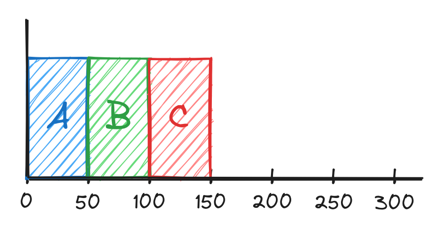
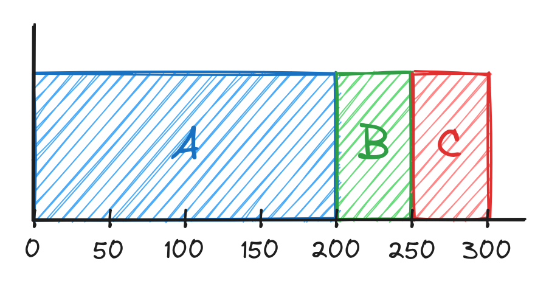
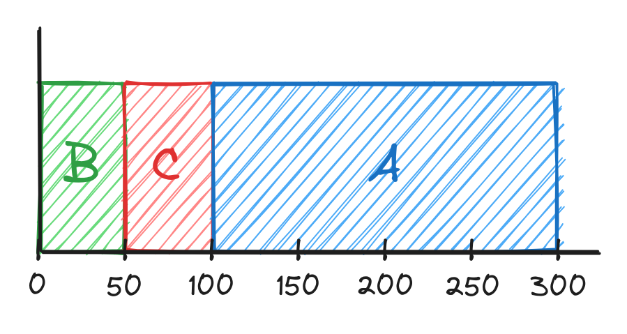
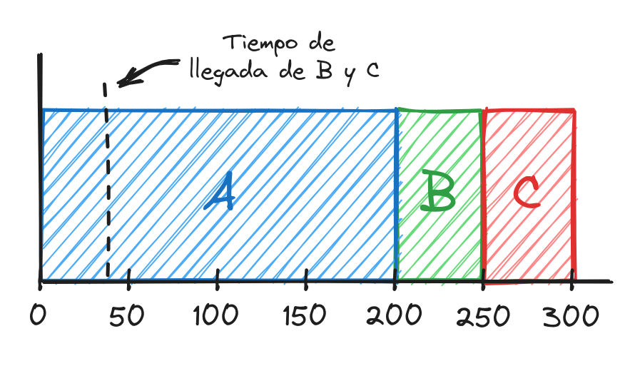
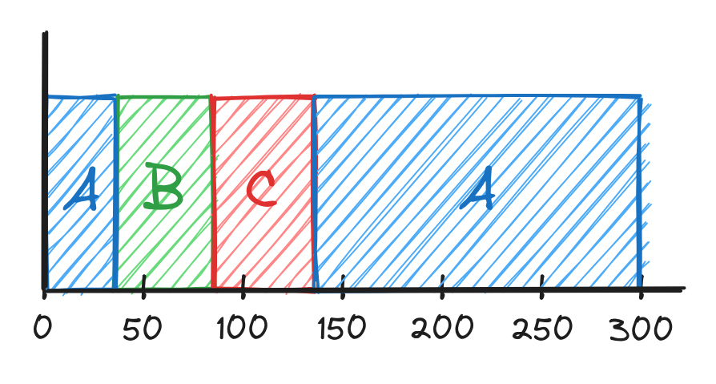
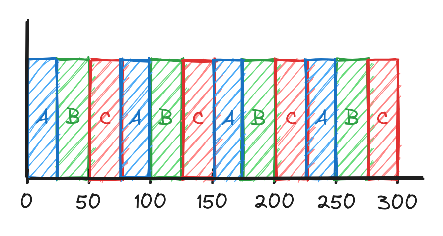
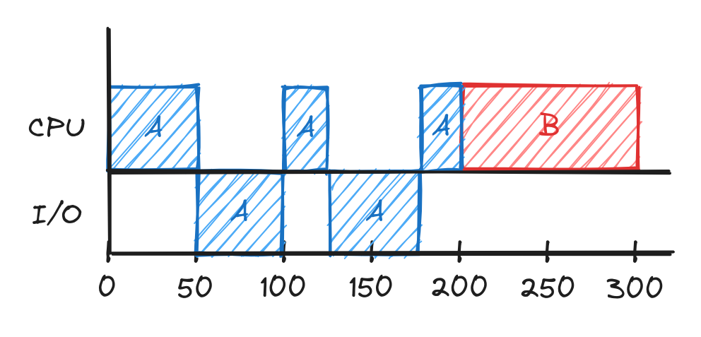
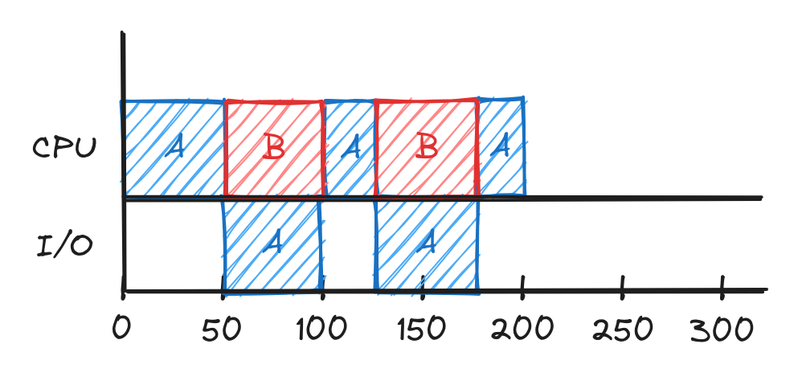

# 3. Scheduling - I

Entonces, ya sabemos que cada cierto tiempo el SO tiene la opción de determinar
qué proceso seguir ejecutando. Sin embargo, ¿que estrategias existen para
determinar en qué orden se deben ejecutar los procesos?

## Métricas

Antes de analizar las estrategias es necesario establecer algunas métricas para
poder compararlas. Existen muchas de ellas, por ahora vamos a calcular una:
**turnaround time**. Esta métrica representa el tiempo que estuvo el proceso
activo, es decir, el tiempo desde que llegó al sistema hasta que finalizó:

$$T_{turnaround} = T_{completion} - T_{arrival}$$

Para analizar las distintas estrategias vamos a realizar además un conjunto de
suposiciones:

1. Cada proceso tiene el mismo tiempo de duración.
2. Todos los procesos llegan al mismo tiempo.
3. Cuando un proceso llega se ejecuta hasta su finalización.
4. Todos los procesos solo usan el CPU (no realizan operaciones I/O)
5. El tiempo de ejecución de cada proceso es conocido.

Estas suposiciones suenan muy poco realistas, pero poco a poco las iremos
eliminando.

## FIFO (First-In First-Out)

La primera estrategia que vamos a analizar se llama **FIFO (First-In
First-Out)** y es bastante simple. Como su nombre lo indica, el primer proceso
que llega es el primer proceso que termina. En otras palabras, los procesos se
ejecutan en orden de llegada.

Por ejemplo, supongamos que tres procesos A, B y C de 50 ms cada uno arrivan al
sistema en ese orden pero con prácticamente en el mismo tiempo (nanosegundos de
diferencia).  Su ejecución sería de siguiente forma:

    

Como todos los procesos llegan en el tiempo 0 (aproximadamente) entonces
$T_{arrival} = 0$ y por tanto $T_{turnaround} = T_{completion}$. Luego, si
calculamos el tiempo turnaround promedio sería:

$$\frac{50 + 100 + 150}{3} = \frac{300}{3} = 100~ms$$

Eliminemos la primera suposición y probemos el siguiente caso donde el proceso A
tiene una duración mayor a los proceso B y C:

    

El turnaround promedio sería:  

$$\frac{200 + 250 + 300}{3} = \frac{750}{3} = 250~ms$$

Aquí radica el principal problema de esta estrategia: si un proceso demora en
terminar el resto de los procesos tienen que esperar.

## SJF (Shortest Job First)

Una idea para resolver este problema es ejecutar primero el proceso que tenga
menos duración. Esta estrategia es conocida como **SJF (Shortest Job First)**.
Si aplicamos esta idea en el ejemplo anterior quedaría así:

    

Donde el turnaround promedio sería:
$$\frac{50 + 100 + 300}{3} = \frac{450}{3} = 150~ms$$

Como se puede ver, con esta estrategia se ejecutaron los mismos tres procesos,
en el mismo tiempo total (300 ms) y mejoramos el valor promedio de turnaround.

Sin embargo, eliminemos la suposición 2 y analicemos el caso en el que B y C
lleguen a los 40 ms:

    

El turnaround promedio sería:

$$\frac{200 + (250 - 40) + (300 - 40)}{3} = \frac{200 + 210 + 260}{3} =  \frac{670}{3} \approx 223.3~ms$$

En el instante 0 solo llega el proceso A y se ejecuta. Dado que estamos
suponiendo que cada proceso debe ejecutarse hasta el final (supuesto 3) no
importa que B y C llegaran un poco después. Ambos procesos deben esperar a que
termine el proceso A para ser ejecutados.

Por tanto la ventaja que ofrece SJF es solo visible en los casos en que los
procesos lleguen justo al mismo tiempo, lo cual no es el caso más común.

### STCF (Shortest Time-to-Completion First)

Para solucionar el problema anterior eliminaremos la suposición 3 y haremos uso
del timer-interrupt para detener un proceso momentáneamente aunque no haya
terminado. En el momento que llegan procesos nuevos y se realiza un interrupt,
una estrategia a seguir puede ser seleccionar el proceso al que le quede menos
tiempo de ejecución. Esta estrategia es conocida como **STCF (Shortest
Time-to-Completion First)**.

Si aplicamos esta estrategia en el último caso quedaría de la siguiente forma:

    

De esta forma el tiempo promedio de turnaround sería:

$$\frac{(300 - 0) + (90 - 40) + (140 - 40)}{3} = \frac{300 + 50 + 100}{3} = \frac{400}{3} \approx 133.3~ms$$

Como pueden ver el turnaround promedio es mucho mejor. Por lo tanto, si
supiéramos el tiempo de ejecución de un proceso y además estamos seguros que no
realiza operaciones I/O, STCF no sería una mala estrategia.

#### Tiempo de respuesta

En los primeros sistemas estas estrategias de scheduling eran factibles. Sin
embargo, la llegada de sistemas que realizaban time-sharing trajo consigo que
los usuarios demandaran que la interacción con el sistema fuera eficiente (sin
esperar tiempos prolongados por operaciones que se hacían de forma recurrentes).

Es por ello que surgió una nueva métrica conocida como **response time** (tiempo
de respuesta). Esta métrica representa el tiempo entre la llegada de un proceso
nuevo y su primera ejecución en el sistema:

$$T_{response} = T_{firstrun} - T_{arrival}$$

Por ejemplo, en el último caso visto el tiempo de respuesta de A es $0 ms$, el
de B es $0~ms$ y el de C es $90 - 40 = 50~ms$ (como promedio sería $16.67~ms$
aproximadamente).

Las estrategias anteriores no son particularmente buenas teniendo en cuenta el
response time. Por ejemplo, en STCF si llegan varios procesos al mismo tiempo el
que demore más será el último en ejecutar, lo cual empeora su tiempo de
respuesta.

### RR (Round Robin)

Para solucionar este problema surge la estrategia **Round Robin**. La idea que
sigue esta estrategia es cambiar de proceso cada cierto intervalo de tiempo. A
este intervalo de tiempo se le conoce como **time slice** o **scheduling
quantum**. Este tiempo debe ser un múltiplo del timer-interrupt.

Por ejemplo, supongamos que el timer-interrupt es de $5~ms$ y se define un time
slice de $25~ms$, y llegan tres procesos A, B y C en el instante cero y con una
duración de $100~ms$ cada uno. La gráfica de ejecución quedaría de la siguiente
forma:

    

El response time promedio sería:

$$\frac{0 + 25 + 50}{3} = \frac{75}{3} = 25~ms$$

Sin embargo, si analizamos el response time usando la estrategia FIFO se obtendría:

$$\frac{0 + 100 + 200}{3} = \frac{300}{3} = 100~ms$$

Esta nueva estrategia trae consigo una dificultad nueva y es ¿qué valor tomar
como time slice? Evidentemente mientras menor sea el time slice menor será el
tiempo de respuesta, sin embargo, esto implica que el SO realice cambios de
contextos más seguido, lo cual puede reducir el rendimiento.

Otro aspecto a tener en cuenta es que RR es una estrategia pésima si se evalúa
teniendo en cuenta el turnaround time. Si se priorizan todos los procesos de
igual forma en cada momento, al final cada uno va a terminar mucho después de su
tiempo original de duración.

### I/O

Hasta ahora todas las estrategias que hemos visto las hemos analizado con
procesos que no realizan pedidos I/O. Eliminemos esta suposición y analicemos el
siguiente caso:

    

En este caso el proceso A tiene una duración de 200 ms, pero en dos ocasiones se
mantiene bloqueado esperando por una operación I/O (cada una con una duración de
100 ms). Por otra parte el proceso B no realiza ninguna operación I/O y tiene
una duración de 200 ms. Evidentemente en este caso se está desaprovechando
tiempo de CPU mientras el proceso A se encuentra bloqueado.

Una solución podría ser tomar cada intervalo en los que A se encuentra usando el
CPU como procesos diferentes (en el ejemplo los tiempos de cada uno serían: 50,
25 y 25 ms). De esta forma el scheduler puede usar el tiempo intermedio para
ejecutar otros procesos:

    

Sin embargo, todas estas estrategias se basan sobre el menos realista de los
supuesto: conocemos el tiempo de ejecución de cada proceso.

¿Cómo podemos implementar una política de scheduling justa sin saber el tiempo
de ejecución total de un proceso? Esto es lo que estaremos analizando en la
siguiente conferencia :)
