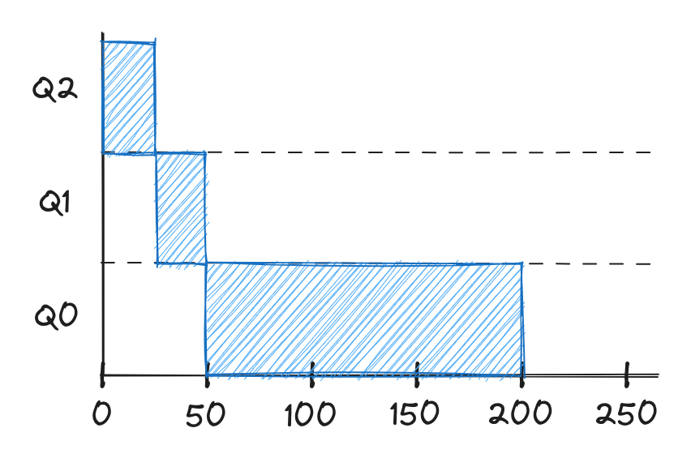
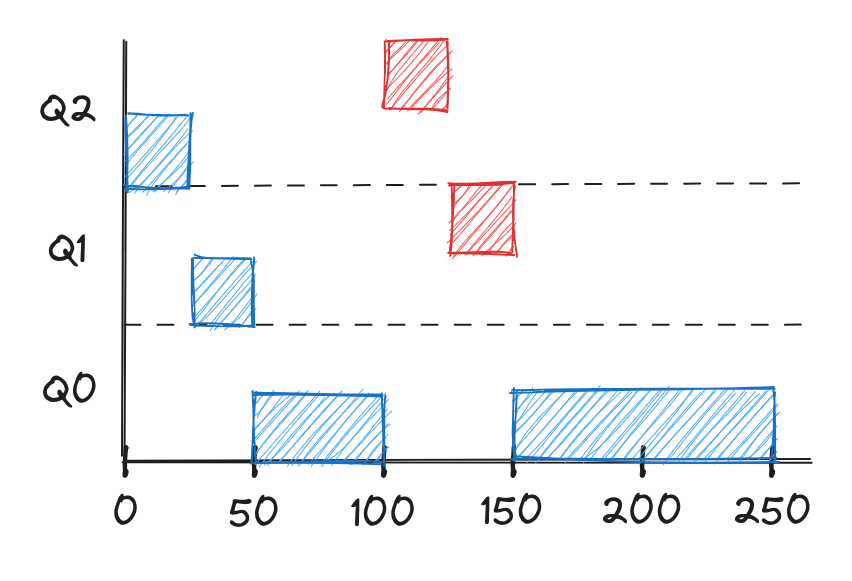
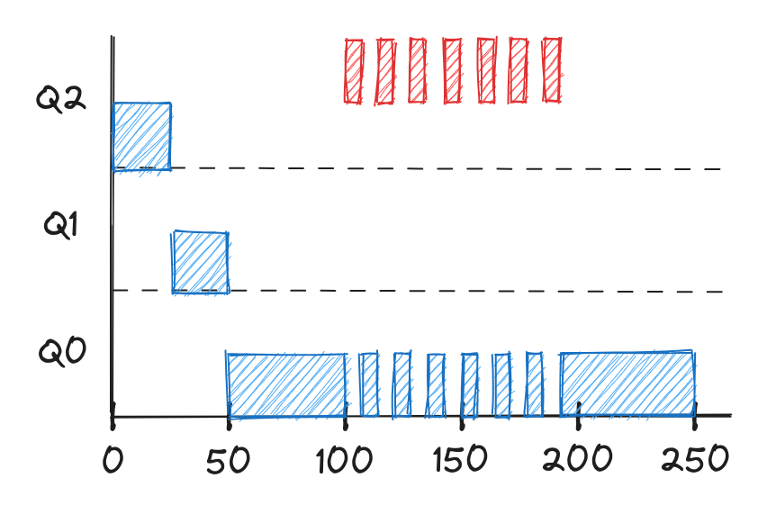
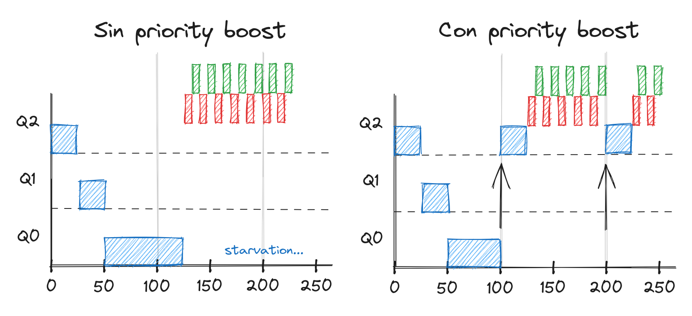
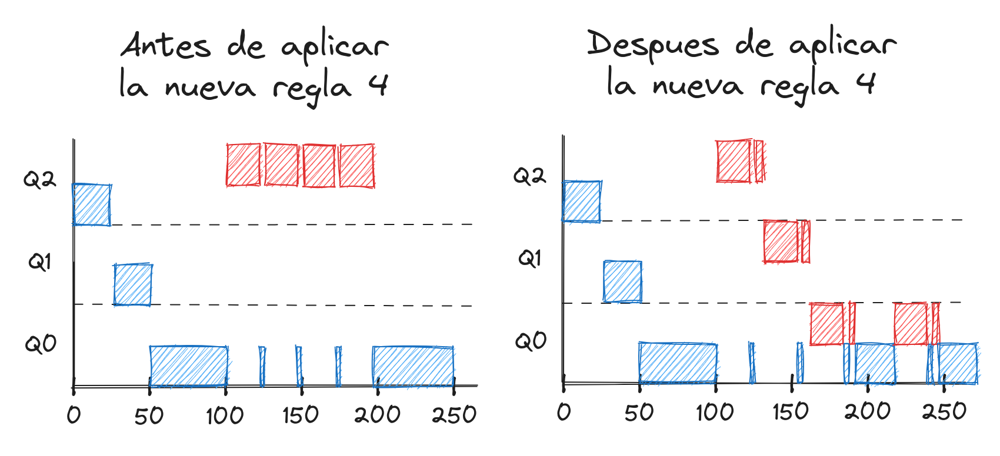

# 4. Scheduling - MLFQ

Entre las estrategias vistas hasta ahora, algunas son buenas para mejorar el
turnaround time, y otras soon buenas para mejorar el response time. Sin embargo,
vimos que generalmente cuando se optimizaba una de las métricas al mismo tiempo
empeoraba la otra. Además, fueron pensadas asumiendo que sabemos el tiempo de
duración de cada proceso.

Si eliminamos esa última suposición, ¿cómo podemos lograr una estrategia que,
aún sin saber el tiempo de ejecución de los procesos, sea justa y optimice tanto
el turnaround como el response time?

La estrategia que estaremos analizando en esta clase es **MLFQ (Multi-level
Feedback Queue)** y persigue precisamente optimizar tanto el turnaround time
como el response time.

## Reglas básicas

La idea principal detrás de MLFQ, como su nombre puede sugerir, es tener una
serie de colas, cada una representando un nivel de prioridad. Cada proceso que
se esté ejecutando se encuentra en una de las colas, y por tanto tiene una
prioridad determinada. En cada **slice time**, el scheduler selecciona el
proceso que esté en la cola con la mayor prioridad. Si existen más de un proceso
en dicha cola entonces se decide cual ejecutar usando la estrategia de Round
Robin.

Estas reglas de forma resumida son:

1. Si `Prioridad(A) > Prioridad(B)`: Se ejecuta A (y no B).
2. Si `Prioridad(A) == Prioridad(B)`: Se selecciona según RR.

La pregunta entonces es ¿cómo asigna MLFQ la prioridad a los procesos? La
prioridad de cada proceso depende de su comportamiento. Si un proceso realiza
muchos pedidos I/O en intervalos cortos de tiempo entonces se aumenta su
prioridad (generalmente estos son los procesos que requieren alta interactividad
del usuario). Por otra parte, si un proceso se mantiene realizando operaciones
en el CPU por largos períodos de tiempo entonces se disminuye su prioridad.

Por tanto, solo queda entender exactamente cómo esta estrategia "aprende" de
cada proceso y cambia sus prioridades.

## Prioridades

Teniendo en cuenta que queremos que la prioridad de procesos que consuman el CPU
por mucho tiempo sea baja y que la prioridad de los procesos con mucha
interactividad (I/O) sea alta, se pueden plantear las siguientes reglas:

3. Cada proceso que llegue al sistema se posiciona en la cola con mayor
prioridad.
4. a) Si un proceso se mantiene en el CPU durante todo el slice time entonces
baja su prioridad por un nivel.
4. b) Si un proceso cede el CPU antes de el slice time, entonces mantiene su
prioridad.

Mostremos el funcionamiento de estas reglas mediante varios ejemplos tomando
como referencia una configuración de 3 colas: Q0, Q1, y Q2, donde Q0 representa
la menor prioridad y Q2 la mayor prioridad. Además se asume un slice time de 25
ms.

En un primer caso, llega un proceso que utiliza de forma prolongada el CPU:

    

Como cada slice time es consumido completo, al terminar cada uno el proceso baja
un nivel su prioridad. Final mente cuando llega la cola con menor prioridad (Q0)
se mantiene en esta misma hasta que termina.

Supongamos que a los 100 ms llega otro proceso (rojo) con una duración de 50 ms.
El gráfico de ejecución sería de la siguiente forma:

    

Como el scheduler no sabe si será un proceso corto o largo, posiciona al nuevo
proceso en la cola de mayor prioridad. Al consumir el primer slice time de su
ejecución (100 ms - 125 ms) el proceso baja una prioridad, sin embargo, sigue su
ejecución en el próximo slice time (125 ms - 150 ms) ya que sigue teniendo más
prioridad que el primer proceso. Finalmente el proceso termina y, como no
existen otros proceso de mayor prioridad, se ejecuta el proceso que estaba en
Q0.

En el último ejemplo, supongamos que el proceso que llega a los 100 ms se
mantiene realizando operaciones de I/O en un tiempo menor al slice time: 

    

En este caso, como el proceso no consume el slice time completo, mantiene su
prioridad. Además, en los momentos que dicho proceso no está utilizando el CPU,
el scheduler ejecuta el primer proceso (azul), ya que es el próximo de mayor
prioridad.

Hasta ahora esta solución tiene tres problemas principales:

- Si existen muchos procesos interactivos todos se van a mantener en las cola de
mayor prioridad y el scheduler nunca ejecutará los procesos de las colas con
menor prioridad. Esto es conocido como **starvation**.
- Se puede engañar al scheduler. Un usuario puede realizar un proceso que justo
antes de finalizar el slice time realice una operación I/O (solo para mantener
la prioridad)
- Un programa puede cambiar su comportamiento a medida que avanza el tiempo y
requerir mayor interactividad en el futuro.

## Priority boost

Una técnica para resolver el **starvation**, y que además favorece a los
procesos que cambian de comportamiento, es el **priority boost**. La idea es
cada cierto tiempo aumentar la prioridad de los proceso. Planteemos una nueva
regla:

5. Cada cierto tiempo $S$, todos los procesos se posicionarán en la cola con
mayor prioridad.

Tomamos $S = 100~ms$ y analicemos el siguiente ejemplo con y sin priority boost:

    

Sin realizar el priority boost el primer proceso (azul) no se ejecutara nunca
más luego del ms 125. Por otra parte, al hacer un boost cada 100 ms, el proceso
vuelve a tener la maxima prioridad (igual que el resto) y puede ejecutarse por
un slice time nuevamente.

Esta solución sin embargo no resuelve el 2do problema: que un programa realice
operaciones I/O antes de cada slice time con tal de mantener la prioridad.

Este problema se puede resolver contando el tiempo de ejecución en CPU de cada
proceso de una mejor forma. En vez de solo contar si el proceso cedió el CPU
antes del slice time, acumularemos el tiempo que lleva cada proceso en cada
nivel. Vamos a modificar las reglas 4a y 4b, y crear la siguiente regla 4:

4. Una vez que el proceso ha consumido un tiempo de ejecución igual al slice
time en un nivel determinado (sin importar cuantas veces haya cedido el CPU), se
disminuirá su prioridad.

Observemos la aplicación de esta regla en el siguiente ejemplo:

    

Finalmente, podemos resumir las 5 reglas principales de MLFQ:

1. Si `Prioridad(A) > Prioridad(B)`: Se ejecuta A (y no B).
2. Si `Prioridad(A) == Prioridad(B)`: Se selecciona según RR.
3. Cada proceso que llegue al sistema se posiciona en la cola con mayor
prioridad.
4. Una vez que el proceso ha consumido un tiempo de ejecución igual al slice
time en un nivel determinado (sin importar cuantas veces haya cedido el CPU), se
disminuirá su prioridad.
5. Cada cierto tiempo $S$, todos los procesos se posicionarán en la cola con
mayor prioridad.

## Otras ideas

Una gran interrogante es ¿cómo parametrizar MLFQ? En la clase pasada vimos las
consecuencias que puede traer tomar un slice time muy pequeño o muy grande. En
MLFQ no solo existe ese parámetro, también hay q decidir cada cuánto tiempo
realizar el priority boost ($S$).

Las implementaciones de MLFQ varían entre los diferentes sistemas, algunas
incluso añaden nuevos parámetros. Por ejemplo, la mayoría de ellas definen un
slice time diferente para cada cola en dependencia de la prioridad (mientras
mayor sea la prioridad menor es el slice time). Esto aumenta aún más el problema
de la parametrización, la cual en ocasiones es incluso puesta a manos del
usuario.

Algunas implementaciones estiman la prioridad de cada proceso de acuerdo a una
fórmula matemática teniendo en cuenta el tiempo que ha consumido del CPU. Otras
implementaciones establecen también prioridades fijas para procesos específicos,
por ejemplo, mantener los procesos del sistema en las colas de mayor prioridad.
