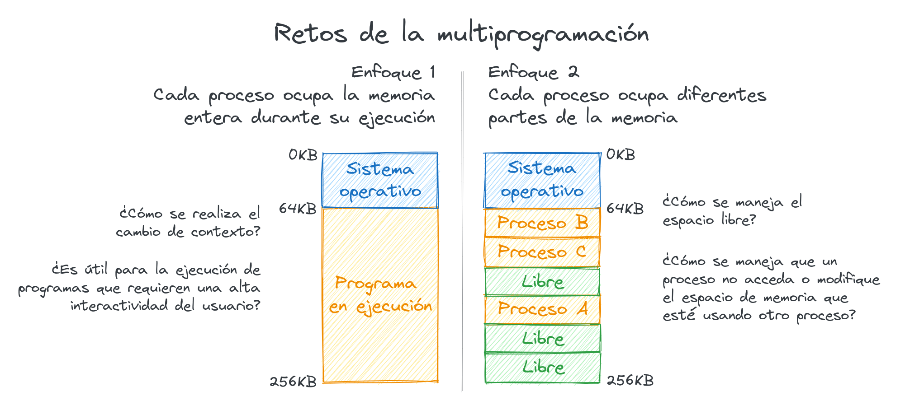
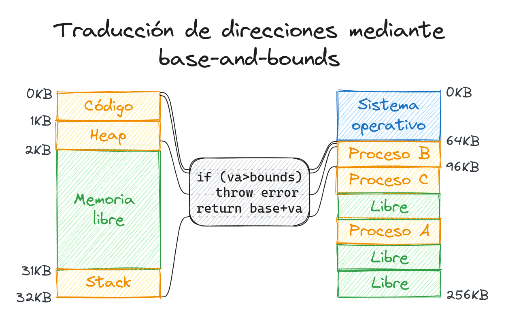

# 5. Memoria - Espacio y traducción de direcciones

Antes de la multiprogramación el espacio de la memoria tenía una estructura
bastante simple. El SO ocupaba la primera parte de la memoria y el resto era
destinado al programa en ejecución. Con el surgimiento de la multiprogramación,
apareció la interrogante de cómo manejar la memoria al ejecutar varios proceso
en el mismo intervalo de tiempo (time sharing).

Un primer enfoque podría ser utilizando la estructura que ya existía, donde cada
proceso ocupaba todo el espacio que no fuera el SO. En cada intercambio de
contexto la memoria se copia a otro lugar y se escribe en su lugar los datos que
tenía el proceso próximo a ejecutar. Sin embargo, esto trae consigo un gasto
temporal significativo entre cada cambio de proceso.

Otro enfoque puede ser dividir el espacio disponible es sectores y asignar a
cada proceso un sector determinado. De esta forma la información de todos los
procesos se mantiene en todo momento en la memoria y el cambio de contexto se
realiza de forma eficiente. Este enfoque es sin duda más prometedor, sin
embargo, relacionado con su implementación surgen varias interrogantes: ¿cómo el
SO puede impedir a un proceso leer o escribir en el espacio de memoria de otro
proceso? ¿cómo se puede aprovechar el espacio libre de una manera eficiente?

<p align="center">
    
</p>

## Espacio de direcciones

La forma que tiene el SO de independizar el uso de la memoria entre procesos es
creando una abstracción de la memoria física, la cual es conocida como el
**espacio de direcciones**. Desde el punto de vista del proceso, el espacio de
direcciones es toda la memoria que existe, y todos los datos en la ejecución del
proceso están contenidos en dicho espacio.

Durante la ejecución de un proceso este espacio tiene tres partes principales:
un segmento donde se encuentra el **código** del programa, un segmento donde
está el **heap** y otro donde está el **stack**. El segmento del código no varía
su tamaño durante la ejecución del programa, por tanto puede ser ubicado en el
inicio del espacio de direcciones. Por otra parte, el heap y el stack pueden
variar su tamaño, por lo que no sería inteligente posicionarlos de forma
contigua. En vez de ello, el heap se posiciona luego del segmento del código, y
el stack al final del espacio de memoria.

<p align="center">
    
</p>

La memoria física que usa el programa no se encuentra desde la dirección 0 hasta
los 16 KB. Esta abstracción es la forma en la que el SO virtualiza la memoria,
ya que cada programa entiende que la memoria que usa comienza desde 0 y que
tiene disponible para indexar direcciones de 32 o 64 bits, cuando en realidad se
encuentra ocupando otra región en la memoria física.

Los tres objetivos principales en la virtualización de memoria son:

- **Transparencia**: El programa usa la memoria como si fuera la memoria física
del sistema. En otras palabras, el programa no sabe que el SO está virtualizando
la memoria.
- **Eficiencia**: El SO debe virtualizar la memoria tan eficiente como pueda,
tanto en tiempo como espacio.
- **Protección**: El SO debe encargarse que un proceso acceda o modifique la
memoria que usa otro proceso.

## API

Antes de entender cómo el SO virtualiza la memora, primero vamos a estudiar cómo
un programa puede hacer uso del espacio de memoria que tiene asignado.

Como se mostró en la sección pasada, en la ejecución de un programa en C existen
dos tipos de memoria que se pueden reservar y liberar: el stack y el heap. En el
stack, el compilador es el que se encarga de reservar y liberar memoria de forma
implícita. Por ejemplo, en el siguiente código el compilador reserva espacio en
el stack para un valor de tipo `int` en la variable `x` y al terminar la función
este espacio es liberado:

```c
void func() {
    int x;
    ...
}
```

¿Y si queremos guardar en memoria algún dato que "sobreviva" al final de la
función? Es aquí donde viene el segundo tipo de memoria: el heap. La memoria que
se reserva y libera en el heap es manejada por el programador[^1]. El siguiente
código es análogo al anterior pero en este caso se reserva espacio para un valor
de tipo `int` en el heap y no se libera al terminar la función:

[^1]: Algunos lenguajes de programación manejan de forma automática la memoria
en el heap mediante diferentes técnicas como garbage collectors o reglas
específicas del compilador.

```c
void func() {
    int *x = (int *) malloc(sizeof(int));
    ...
}
```

Es necesario aclarar que en esta linea el compilador también reserva espacio en
el stack para la variable `x`, la cual contiene el puntero (dirección) donde se
encuentra el valor en el heap.

Este último ejemplo muestra una de las funciones principales que ofrece el
lenguaje C para el manejo de memoria `malloc`.  Esta función recibe como único
argumento un `size_t` que indica cuántos bytes el programador desea reservar y
devuelve un puntero al lugar de memora donde se reservó el espacio.

Reservar espacio en el heap no es complicado, el problema principal está en
saber cuándo y cómo liberar dicho espacio. Para liberar un espacio reservado en
el heap se usa la función `free`, por ejemplo:

```c
void func() {
    int *x = (int *) malloc(sizeof(int));
    ...
    free(x);
}
```

Como pueden notar, la función `free` recibe como único argumento el puntero
donde se encuentra el espacio a liberar. Esto indica que la librería encargada
del manejo de memoria sabe el tamaño del espacio reservado para cada puntero.

El manejo de memoria por parte del programador puede ser complicado. Entre los
errores comunes que se suelen cometer están:

- Olvidar reservar la memoria:

    ```c
    void func() {
        char *src = "hello world";
        char *dst;                  // No se inicializa
        strcpy(dst, src);           // Error :(
    }
    ```

- No reservar memoria suficiente:

    ```c
    void func() {
        char *src = "hello world";
        char *dst = (char *) malloc(5 * sizeof(char));  // Tamaño insuficiente
        strcpy(dst, src);                               // Error :(
    }
    ```

- Olvidar liberar la memoria:

    Si un espacio reservado de memoria es usado durante todo el programa, al finalizar el mismo no es necesario liberar toda la memoria reservada, de esto se encarga el SO de forma automática. Sin embargo, sí **es importante liberar la memoria reservada que no se utilice más a partir de un punto en la ejecución del programa**. En caso de no hacerlo se corre el riesgo de ocupar todo el espacio disponible.

- Usar un espacio de memoria luego de ser liberado:

    ```c
    void func() {
        int *x = (int *) malloc(sizeof(int));
        free(x);
        *x = 5;  // Error :(          
    }
    ```

- Liberar el mismo espacio más de una vez:

    ```c
    void func() {
        int *x = (int *) malloc(sizeof(int));
        free(x);
        free(x);  // Error :(
    }
    ```

A pesar de parecer simples y fáciles de identificar, los errores en los ejemplos
anteriores son los más comunes en el manejo de memoria. Además, son errores que
el compilador no detecta (en algunos casos puede mostrar advertencias), por lo
que todos pueden co-existir en un programa ejecutable.

## Traducción de direcciones

Ya sabemos que las direcciones de memoria que maneja un programa no son las
direcciones de la memoria física. Por tanto, para que el SO pueda crear esta
abstracción (espacio de direcciones), es necesario en cada instrucción que
cargue o lea de una dirección de memoria virtual se "traduzca" a una dirección
de memoria física.

¿Cómo se convierte entonces una dirección virtual a una dirección física durante
la ejecución de un proceso?

Uno de los primeros mecanismos usados a finales de los 50's con el surgimiento
del time-sharing es conocido como **Dynamic (Hardware-based) Relocation** o
**Dynamic Relocation**. En el CPU se agregaron dos registros especiales: el
registro **base** y el registro **bounds**. Con este par de registros se
indicaba el inicio y el tamaño que ocupaba un proceso en la memoria física. Por
ejemplo, si el registro base contiene el valor 64 KB (65536) y el registro
bounds contiene el valor 32 KB (32768) esto indica que la memoria que está
usando el proceso actual comienza en la dirección física 65536 y tiene un tamaño
de 32768, o sea, se extiende hasta la dirección física 98304.

Una vez establecidos estos registros, es el hardware quien convierte una
dirección virtual a una dirección física cada vez que sea necesario. Esta
operación es simple, supongamos que la dirección virtual es `va` y se quiere
saber la dirección física (`pa`) que representa, el hardware haría lo siguiente:

1. Si `va > bounds` lanza un error. El programa trató de acceder a una dirección
fuera de su espacio de memoria.
2. En caso contrario, `pa = base + va`.

<p align="center">
    
</p>

Por ejemplo, si tomamos los valores establecidos anteriormente, base = 64 KB
(65536) y bounds = 32 KB (32768), se realizarían las siguientes conversiones:

- 0 $\rightarrow$ 65536 (primera dirección, igual al valor base)
- 130 $\rightarrow$ 65696
- 131 $\rightarrow$ 65697
- 32768 $\rightarrow$ 98304 (última dirección, base + bounds)

Al usar esta estrategia surgen entonces nuevas tareas para el SO. El mismo debe
guardar para cada proceso los valores de base y bounds, y actualizar los
respectivos registros en cada intercambio de contexto. Además, el SO debe
almacenar de alguna forma qué espacios de memoria física están libres para los
nuevos procesos. Esto lo puede realizar mediante una estructura llama free-list.
Finalmente cuando un proceso termina, el SO debe actualizar esta estructura para
retomar el espacio usado como libre.

¿Qué pasa entonces con el espacio entre el heap y el stack? ¿No se podría
emplear de una mejor forma? Esto lo estaremos viendo en la próxima clase :)
