# 6. Memoria - Segmentación y manejo del espacio libre

Como vimos en la clase pasada la estrategia de base-and-bounds permite
posicionar cada espacio de direcciones de forma independiente en la memoria
física. Sin embargo, el gran problema que tiene esta estrategia es que la mayor
parte del espacio de memoria es espacio libre. Si un programa no utiliza el
espacio de direcciones completo, este espacio libre puede ser usado por otros
programas.

## Segmentación

La idea que surgió para resolver este problema es una generalización de la
estrategia base-and-bounds. El espacio de direcciones se separa en segmentos
(por ejemplo: código, heap y stack) y se establece un base y un bound para cada
uno de estos segmentos:

    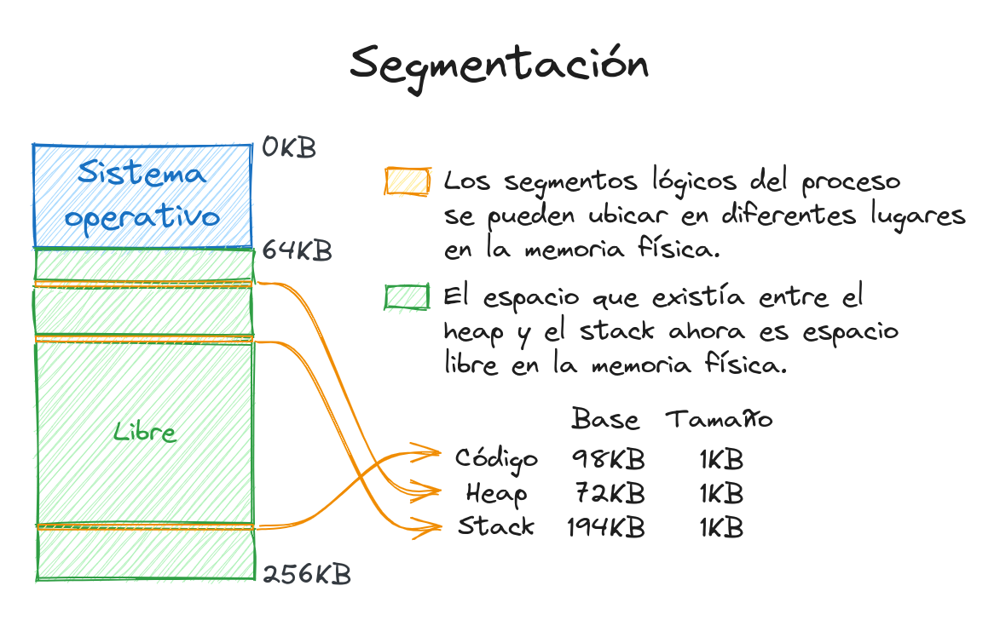

De esta forma el SO puede ubicar cada uno de ellos en regiones diferentes de la
memoria física y aprovechar el espacio libre entre el stack y el heap.

¿Cómo sabe el hardware a que segmento se refiere una dirección virtual?

Uno de los primeros métodos usados para determinar el segmento de una dirección
era indicándolo en sus bits más significativos. Al tener 3 segmentos
principales, es necesario usar 2 bits para indicar a cual pertenece una
dirección. Por ejemplo, si usamos direcciones virtuales de 14 bits, los bits 13
y 12 indican el segmento y del 11-0 se refieren al offset:

    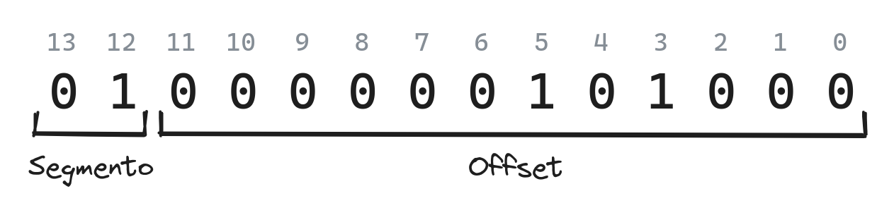

Una vez que se determina el segmento, solo basta analizar si el offset está
dentro de los límites del tamaño del segmento. Si esto se cumple, la dirección
física se obtiene sumando el offset con el valor base del segmento.

Es importante aclarar que con 2 bits se pueden indicar 4 segmentos, por lo que
un grupo de direcciones considerables no se podrán usar. Para evitar esto
algunos sistemas posicionan el segmento de código junto al heap, y utilizan solo
un bit para determinar si la dirección es del código-heap o del stack.

Existen otras formas de identificar a qué segmento pertenece una dirección.
Otros sistemas determinan el segmento en dependencia de cómo se formó la
dirección. Si la misma se formó a partir del registro que contiene el IP
(instruction pointer) o el registro que contiene el SP (stack pointer) la
dirección se sabe que pertenece al segmento de código o stack respectivamente.
Cualquier otra dirección se puede asumir que es del heap.

## Dirección de crecimiento

Un aspecto clave a tener en cuenta es que el stack no crece en memoria igual que
el heap, sino que lo hace en dirección contraria. Por tanto es necesario que el
hardware tenga información también sobre cómo crece cada segmento:

    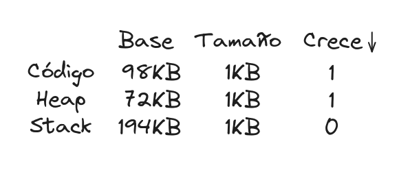

Esto significa que es necesario realizar un cálculo diferente cuando las
direcciones del segmento no están posicionadas de forma creciente. Si este es el
caso, entonces se le resta al offset el tamaño máximo que puede tener el
segmento (lo cual resulta en un valor negativo), se analiza si el valor absoluto
del resultado está dentro del tamaño permitido del segmento y luego se suma
dicho valor negativo a la base del segmento.

Por ejemplo, si las direcciones del espacio son de 14 bits (como los ejemplos
anteriores), si se toman dos bits para indicar el segmento entonces quedan 12
bits de offset. Por tanto, el tamaño máximo que puede tener el segmento es 4 KB
($2^{12}$ bytes). Si el segmento de una dirección indica que pertenece al stack
y tiene un offset de 3 KB, entonces se halla la diferencia: $4 KB - 3 KB = -1
KB$. Luego, este valor se suma a la base: $194 KB + (-1 KB) = 193 KB$.

## Memoria compartida

Una forma de aprovechar el espacio en la memoria física es compartir un mismo
segmento entre diferentes procesos. Por ejemplo, si un mismo programa se ejecuta
más de una vez, no es necesario tener el mismo código repetido en la memoria.
Sin embargo, es necesario tener un nivel de protección adicional sobre los
segmentos. Para ello, el hardware ofrece los **bits de protección**:

    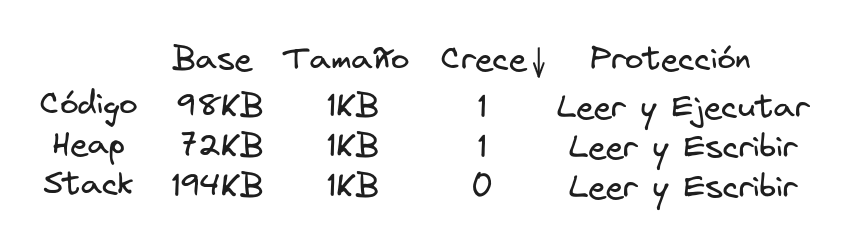

Con esto, el hardware debe además en cada operación analizar el tipo de acceso
de cada dirección según su segmento. De esta forma un proceso puede usar el
segmento de código de otro proceso que esté ejecutando el mismo programa sin
peligro de ser modificado.

Además de todos estos cambios en el hardware, el SO también funciona de manera
diferente. Por ejemplo, en cada intercambio de contexto, el SO debe ahora
actualizar varios registros más que solo un registro base y un registro bounds.
Por otra parte, el SO debe manejar donde ubicar los segmentos (potencialmente de
tamaños diferente) en la memoria física de una forma eficiente.

## Manejo del espacio libre

El problema principal que surge con la segmentación es la fragmentación, muchos
segmentos en diferentes lugares que generan a su vez muchas regiones pequeñas de
espacio libre. Esto puede causar que no existan en la memoria regiones de
espacio relativamente grandes disponible de forma continua.

Este problema no solo ocurre a nivel de SO en la memoria física, sino también a
nivel de usuario en el manejo de la memoria del heap mediante alguna librería,
por ejemplo usando `malloc` y `free` en C.

Una solución al problema de la fragmentación podría ser, cada cierto tiempo,
compactar toda la memoria usada en una sola región continua. Sin embargo, mover
todos los datos de la memoria de un lado a otro es demasiado costoso en tiempo.
Además algunas regiones no podrían crecer. Es por ellos que analizaremos algunas
estrategias para el manejo de la memoria que reducen el problema de
fragmentación.

Antes de adentrarnos en las diferentes estrategias, es necesario explicar qué
pasa con el espacio libre cuando se reserva la memoria y cuando se libera y cómo
se lleva constancia de cuáles regiones libres existen.

## División y fusión

La estructura que guarda la información sobre qué regiones de la memoria están
libres es conocida usualmente como **free list**. Por ejemplo:

    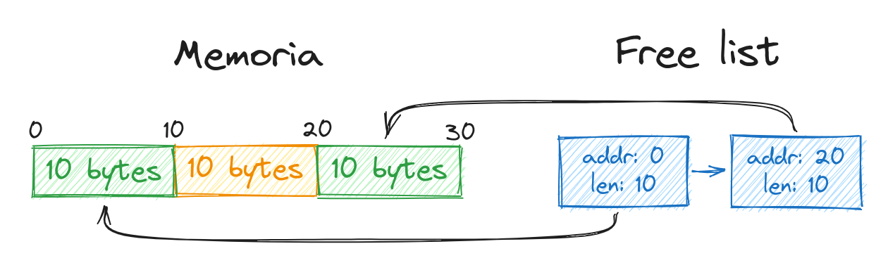

En este ejemplo, debido a la fragmentación, un programa no pudiera reservar 15
bytes de memoria, ya que no existe una región continua lo suficientemente
grande. Sin embargo, el espacio total disponible es de 20 bytes.

Si un programa necesita reservar, por ejemplo, 5 bytes, se busca en la free list
un espacio lo suficientemente grande y se realiza una **división** del mismo. Si
el programa que maneja la memoria determinó que se usaría el segundo espacio
disponible la free list quedaría de la siguiente forma:

    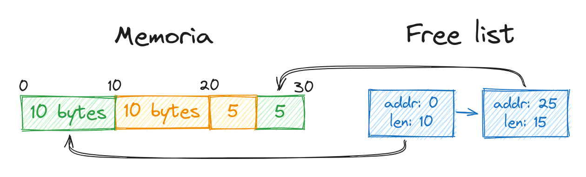

Por otra parte, tomando el ejemplo original (10 bytes libres, luego 10 bytes en
uso y luego 0 bytes libres), si se liberan los 10 bytes en uso que existen, la
free list puede quedar así:

    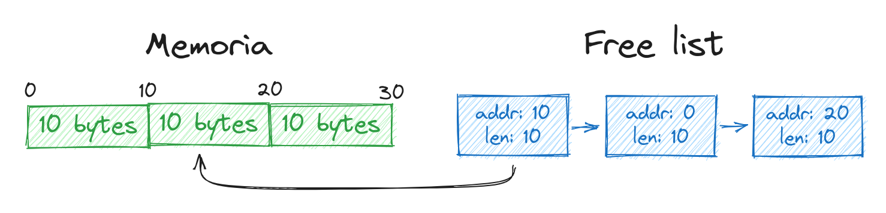

Si en este estado un programa pide reservar 25 bytes no podría, ya que la lista
solo tiene espacios libres de 10 bytes, pero sabemos que existen 30 bytes
continuos disponibles. Es aquí donde ocurre la **fusión**. El programa que
maneja la memora, al liberar una región, analiza si existen regiones adyacentes
libres y fusiona todas las regiones continuas en una sola entrada en la free
list.

    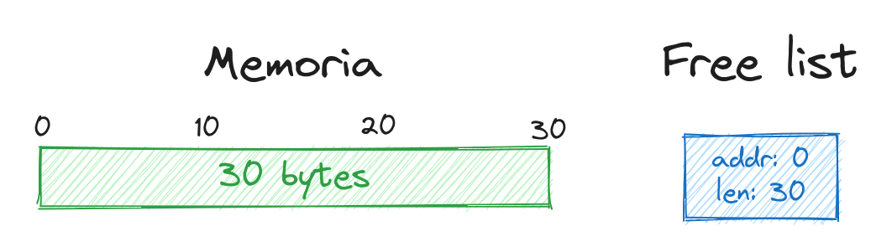

Existen 4 estrategias principales que estaremos analizando: **best fit**,
**worst fit**, **first fit** y **next fit**. En las siguientes secciones se
explica cada una.

### Best fit

La idea de esta estrategia es, cada vez que se quiere reservar una región,
utilizar la entrada de la free list cuyo espacio sea el más ajustado al que se
quiere reservar. En el siguiente ejemplo, si se quisiera reservar 15 bytes, esta
estrategia seleccionaría la última entrada:

    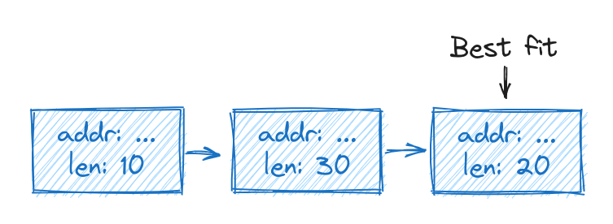

### Worst fit

Esta estrategia es parecida a **best fit**, solo que en vez de seleccionar la
entrada donde mejor se ajusta el espacio a reservar, se selecciona la entrada
que peor ajusta. Si tomamos el ejemplo anterior como referencia, esta estrategia
seleccionaría la segunda entrada:

    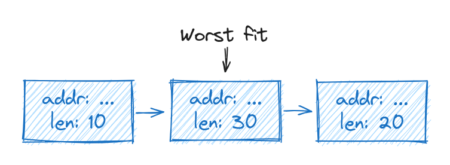

### First fit

Esta estrategia selecciona la primera entrada donde quepa el espacio a reservar.
La ventaja que ofrece sobre las estrategias anteriores es la rapidez. Al usar
esta estrategia, las entradas en la free list generalmente se mantienen
ordenadas según la dirección en memoria. Esto hace más fácil la fusión de
regiones de espacio libres contiguas y reduce la fragmentación.

### Next Fit

Similar a **first fit**, con la diferencia que se lleva constancia de la última
entrada donde se reservó memoria. Cada vez que es necesario reservar un espacio
nuevo, se empieza donde se había quedado la vez anterior. Esto permite que la
información se esparza en la memoria y no se acumule solo al inicio.

### Otras estrategias

Existen otras estrategias pensadas directamente para evitar la fregmentación u
optimizar la fusión como **segregated list** o **buddy allocation**.

En ocasiones, un programa realiza varios pedidos de un mismo tamaño para
reservar memoria. En la estrategia **segregated list**, cuando esto ocurre, se
crea una lista aparte donde cada entrada es de dicho tamaño. Esto hace más fácil
el proceso de reservar la memoria y evita la fragmentación.

Por otra parte, en la estrategia **buddy allocation**, la memoria se divide como
un árbol binario:

    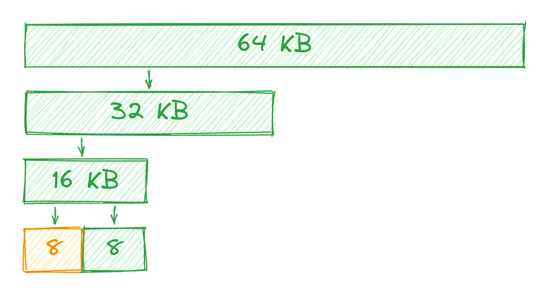

Cuando un programa reserva un espacio de memoria se va dividiendo cada sector en
dos hasta encontrar el sector que mejor lo ajuste (el punto donde la siguiente
división crea espacios más pequeños que tamaño a reservar). Por otra parte
cuando se libera un sector, y el sector del mismo tamaño contiguo también está
libre, se fusionan, y este proceso se ejecuta de formar recursiva hacia la raíz
mientras sea posible.

El principal problema con segmentación ya vimos que es la fragmentación,
¿existirá una mejor forma de organizar estos segmentos en la memoria? En la
próxima conferencia estaremos viendo otra estrategia que aborda dicho problema.
